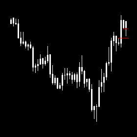
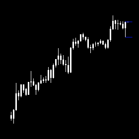
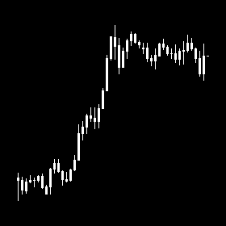
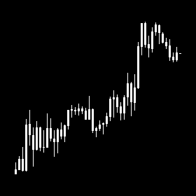
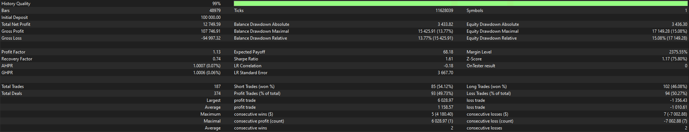
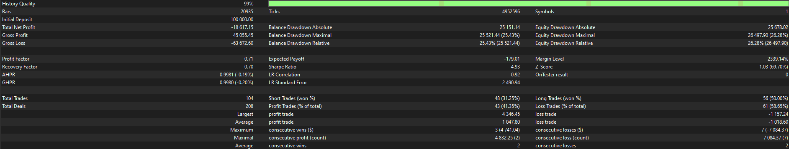

# Strategy Research and Development Case

This case shows my approach to turning a manual trading strategy into an automated trading system.

## Goal

To develop a production-ready automated trading system for live trading with capital.

## Terminology
This case uses several Price Action concepts and abbreviated candlestick timeframe terms:

- **FVG (Fair Value Gap)** - a support/resistance zone in Price Action
- **Order Block (OB)** - a candlestick pattern in Price Action used as confirmation of a support/resistance zone
- **Risk-Reward Ratio (RR)** - the ratio of expected reward to predefined risk for an trade
- **4H** - 4-hour candlestick timeframe
- **1H** - 1-hour candlestick timeframe

## Initial Strategy
The initial strategy was based on the following setup:

**Newest 4H FVG + 1H Order Block**

The strategy identifies the newest support or resistance zone, then looks for the first retest of that zone together with the appearance of confirmation.

From this baseline idea, various conditions and filters will be applied to identify the conditions under which the strategy could be more predictable and suitable for live trading.

This strategy was developed and tested using EURUSD data.

The images above show the same setup on two different timeframes: 4H for the FVG and 1H for the Order Block confirmation.

<table>
  <tr>
    <td align="center">
       
      <b>4H FVG</b>
    </td>
    <td align="center">
       
      <b>1H Order Block</b>
    </td>
  </tr>
</table>

## Manual Validation and Hand Labels
I integrated the strategy into my research infrastructure, which automatically captured chart screenshots for every detected setup. These screenshots were then reviewed manually to validate setup quality and assign a label.

Hand labeling was the most important step in this research process.

It acted as an early decision filter: if I could not consistently detect higher-quality setups from weaker ones before entry from a trader’s perspective, then the idea was not worth developing further.

This was a critical checkpoint, because it could save months of work that would otherwise be spent refining an idea with no real predictive structure.

Each setup was manually labeled as **Valid Entry**, **No Entry**, or **Unclear**.

This process helped me understand where the strategy actually worked, where it failed, and whether the setup showed enough consistency to justify deeper quantitative research.

Examples below show 1H chart structures used during manual validation. To improve dataset coverage, my research infrastructure can transform short setups into equivalent long-format examples. Since the setup is direction-neutral in EURUSD, this transformation was suitable and allowed me to increase the effective sample size.

In each example, the rightmost candle represents the point at which the strategy detected the setup.
<table>
  <tr>
    <td align="center">
       
      <em>Figure 1. Clean retest with confirmation.</em> 
      <strong>Label: Valid Entry</strong>
    </td>
    <td align="center">
       
      <em>Figure 2. Extremum no longer valid.</em> 
      <strong>Label: No Entry</strong>
    </td>
  </tr>
  <tr>
    <td align="center">
       
      <em>Figure 3. Confirmation structure is unclear.</em> 
      <strong>Label: Unclear</strong>
    </td>
    <td align="center">
       
      <em>Figure 4. Valid retest at the London session open.</em> 
      <strong>Label: Valid Entry</strong>
    </td>
  </tr>
</table>

### Manual labeling process

For manual labeling, I selected **2015, 2020, 2021, and 2025**.  
These years were chosen intentionally to test whether the strategy remained stable across different market regimes.
All labels were assigned manually **before** reviewing the final trade outcome.

### Match rate / validation outcome

In **2025**, the strategy generated **143 setups**. 

Among **53 Valid Entry** labels, **29** resulted in clear continuation, **9** were unclear, and **15** turned out to be fake. This gives a **Valid Entry precision of 54.7%** (**29 / 53**).

There were **32 Unclear** labels. This category was used to avoid forcing borderline setups into either **Valid Entry** or **No Entry**. Their outcomes were mixed: **12** continuation, **5** unclear, and **15** fake.

Among **58 Fake / No Entry** labels, **42** were correctly identified as fake, giving a **72.4% precision** (**42 / 58**). This suggested that the strategy was more effective at filtering weak setups than at selecting high-quality entries.

  
<b>2021 Validation Summary</b>

In <b>2021</b>, the strategy generated <b>123 setups</b>.

Among <b>58 Valid Entry</b> labels, <b>29</b> resulted in clear continuation, <b>5</b> were unclear, and <b>24</b> turned out to be fake. This gives a <b>Valid Entry precision of 50.0%</b> (<b>29 / 58</b>).

There were <b>24 Unclear</b> labels: <b>5</b> resulted in continuation, <b>2</b> remained unclear, and <b>17</b> turned out to be fake.

Among <b>41 Fake / No Entry</b> labels, <b>34</b> were correctly identified as fake, giving an <b>82.9% precision</b> (<b>34 / 41</b>).

  
<b>2020 Validation Summary</b>

In <b>2020</b>, the strategy generated <b>104 setups</b>.

Among <b>48 Valid Entry</b> labels, <b>32</b> resulted in clear continuation, <b>4</b> were unclear, and <b>12</b> turned out to be fake. This gives a <b>Valid Entry precision of 66.7%</b> (<b>32 / 48</b>).

There were <b>31 Unclear</b> labels: <b>15</b> resulted in continuation, <b>7</b> remained unclear, and <b>9</b> turned out to be fake.

Among <b>25 Fake / No Entry</b> labels, <b>19</b> were correctly identified as fake, giving a <b>76.0% precision</b> (<b>19 / 25</b>).

  
<b>2015 Validation Summary</b>

In <b>2015</b>, the strategy generated <b>106 setups</b>.

Among <b>41 Valid Entry</b> labels, <b>22</b> resulted in clear continuation, <b>7</b> were unclear, and <b>12</b> turned out to be fake. This gives a <b>Valid Entry precision of 53.7%</b> (<b>22 / 41</b>).

There were <b>29 Unclear</b> labels: <b>14</b> resulted in continuation, <b>2</b> remained unclear, and <b>13</b> turned out to be fake.

Among <b>36 Fake / No Entry</b> labels, <b>30</b> were correctly identified as fake, giving a <b>83.3% precision</b> (<b>30 / 36</b>).

## Why the Idea Was Worth Developing

Manual review showed that the setup had a recognizable and repeatable structure. From a discretionary perspective, the results did not appear fully random, which suggested that the strategy contained enough signal to justify further development.

This was the point where the work moved from visual pattern recognition to formal rule design, feature extraction, and systematic validation.

## Observation
Market behavior differs across trading sessions.

To reduce noise and build a more stable trading system, it makes sense to apply additional conditions. One of the key observations was that an Order Block formed during the **London open** or **New York open** may carry greater significance.

These periods are typically associated with higher volatility and stronger market participation. As a result, when confirmation appears during these sessions, the setup have a higher probability of success.

Another important observation was related to trade exits. For better stability and predictability, it is preferable to use a clear and static target rather than a dynamic one.

In this strategy, a suitable target is the **high extremum of the support zone** for long trades, and the **low extremum of the resistance zone** for short trades. In other words, once the newest zone is identified and then successfully retested, the corresponding extremum of that zone can be used as the trade target.

These two observations were applied to Strategy and used as part of the baseline system design. The next step was to review the baseline performance.

## Baseline Performance

Summary report for **2015-2026**:

| Metric | Combined Result |
|---|---:|
| Backtest Coverage | 2015.01 - 2026.12 (split baseline) |
| Total Net Profit | -$5,867.56 |
| Gross Profit | $152,802.36 |
| Gross Loss | -$158,669.92 |
| Profit Factor | 0.96 |
| Expected Payoff | -$20.52 |
| Total Trades | 291 |
| Profit Trades | 136 |
| Loss Trades | 155 |
| Win Rate | 46.74% |
| Average Profit Trade | $1,123.55 |
| Average Loss Trade | -$1,023.68 |

Click the report images below to open them in full size.

<a href="images/strategy-research-and-development-case/baseline_report_2015-2022.11.png">
   
</a>
<em>Figure 1. Baseline report for 2015.01-2022.11.</em>

  

<a href="images/strategy-research-and-development-case/baseline_report_2022.11-2026.png">
   
</a>
<em>Figure 2. Baseline report for 2022.11-2026.</em>

  
<b>Baseline data source note</b>

The baseline and all subsequent backtests were performed in <b>MetaTrader 5</b>, while the trading system itself was written in <b>MQL5</b> (a C++-style trading language).

The baseline evaluation was split into two backtests because the historical data source differed by period.

- <b>2015.01 - 2022.11</b> used a <b>custom EURUSD symbol</b> built for higher-quality historical data.
- <b>2022.11 - 2026.12</b> used the later-period dataset available in the standard environment.

Together, these two tests provide the full baseline view of the strategy before additional refinements.

## Trade-Level Feature Infrastructure

As mentioned earlier, I connected the trading system to my infrastructure, which also logs trade information into a CSV file.  
Each row in this dataset represents one trade together with its features.

For this trading system, I used features related to session, volatility, market conditions, and also coded additional features related to the mechanics of the strategy.

In this strategy, all features are collected before the trade is opened, at the moment when the system detects the setup.

  
<b>About the features</b>

The features are simply my specific ideas encoded in code.

If there is a concrete and formalizable idea - something that can be clearly described in words - it can also be encoded and added as a feature.

This trade-features CSV dataset also makes it possible to apply **tabular machine learning** as a simpler way to search for patterns and relationships in the strategy behaviour, as long as the features meaningfully describe the current market state and vary enough across trades to contain signal.

  
<b>Trade-features dataset preview (first 10 rows)</b>

| ts | trade_id | symbol | RangeA_ATR | SumOppBody5_ATR | RangeExpansion | has_open_fvg_in_range | DistanceToExt_ATR | is_profitable | profit |
|---|---:|---|---:|---:|---:|---:|---:|---:|---:|
| 2015.01.12 16:00:00 | 2  | EURUSD.TDS | 1.090831 | 4.212656 | 2.321373 | 1 | 2.570760 | 0 | -1048.17 |
| 2015.01.28 12:00:00 | 4  | EURUSD.TDS | 1.641236 | 3.074060 | 1.194796 | 0 | 2.973011 | 0 | -999.12 |
| 2015.02.06 12:00:00 | 6  | EURUSD.TDS | 1.289266 | 2.483616 | 1.314146 | 0 | 3.607912 | 0 | -999.60 |
| 2015.03.03 11:00:00 | 8  | EURUSD.TDS | 1.642288 | 3.598841 | 1.910975 | 0 | 1.055707 | 1 | 449.55 |
| 2015.03.12 16:00:00 | 10 | EURUSD.TDS | 1.812203 | 2.980422 | 1.320446 | 1 | 2.993758 | 1 | 1717.17 |
| 2015.04.17 11:00:00 | 12 | EURUSD.TDS | 2.143426 | 1.828685 | 1.908151 | 0 | 1.265353 | 1 | 645.84 |
| 2015.05.25 11:00:00 | 14 | EURUSD.TDS | 1.094714 | 1.464758 | 1.430657 | 0 | 0.447557 | 1 | 266.11 |
| 2015.05.29 11:00:00 | 16 | EURUSD.TDS | 2.178256 | 2.377257 | 1.417536 | 0 | 0.580364 | 1 | 307.80 |
| 2015.06.08 12:00:00 | 18 | EURUSD.TDS | 2.110211 | 2.949757 | 1.466516 | 0 | 1.510581 | 0 | -999.94 |
| 2015.06.09 17:00:00 | 20 | EURUSD.TDS | 1.299953 | 2.142454 | 1.514296 | 0 | 2.839309 | 1 | 2458.94 |

The full CSV file is also available here:  
[Open full CSV](images/strategy-research-and-development-case/FVG_OB_2015-2025.csv)

## Filter 1: Trouble Area Before Target

During the **manual validation / hand-labeling** stage, I noticed that trades often performed worse when there was an **open opposite FVG in the range between entry and target**.

This became one of the first observations I decided to test quantitatively.  
The reasoning was straightforward: if such an imbalance remains open in front of the trade, it may act as a **trouble area before TP** and increase the probability of a losing outcome.

| has_open_fvg_in_range | Trades | Share % | Wins | Losses | Win rate % | Sum profit | Avg profit | Median profit | Avg win | Avg loss | Profit factor | Avg rr_ext |
| --------------------- | -----: | ------: | ---: | -----: | ---------: | ---------: | ---------: | ------------: | -------: | -------: | ------------: | ---------: |
| 0                     |    164 |   56.36 |   96 |     68 |      58.54 |   8,406.82 |      51.26 |        209.07 | 1,030.20 | -1,338.46 |         1.087 |      1.025 |
| 1                     |    127 |   43.64 |   40 |     87 |      31.50 | -13,326.96 |    -104.94 |       -999.68 | 1,985.68 | -1,032.28 |         0.884 |      2.499 |

The difference was large enough to treat this as a meaningful filter.

Trades **without** an open FVG in the range showed:
- higher win rate,
- positive total and average profit,
- and a profit factor above 1.

This suggested that leaving an unresolved imbalance in front of the trade often reduced the probability of clean target delivery, so I kept this condition as one of the strategy filters.

  
<b>How this filter was checked</b>

This comparison was produced from the trade dataset with features by grouping trades by `has_open_fvg_in_range` and comparing win rate, PnL, profit factor.

If you want to check it yourself, you can use the CSV file together with this Jupyter notebook:  
[Filter 1 notebook](images/strategy-research-and-development-case/Filter_Trouble_Area.ipynb)

## Filter 2: RR to Extremum

## Result: Higher Win Rate, but Weak Expectancy
## Conclusion:

## Next Research Direction: Improving Expectancy
- limit entries
- alternative execution logic

## Additional Research Branches
- second Order Block entry
- first-touch Order Block entry

## Key Takeaways
