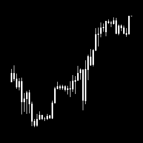
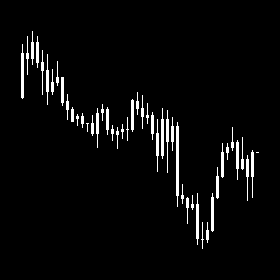

# Strategy Research and Refinement Case

This case shows how an initial trading idea was tested, refined, and filtered into a more selective setup with improved performance characteristics.

## Goal
To test and refine a simple price action strategy, and identify the market conditions in which it performs more reliably.

## Terminology
This case uses several Price Action concepts and abbreviated candlestick timeframe terms:

- **FVG (Fair Value Gap)** — a support/resistance zone in Price Action
- **Order Block (OB)** — a candlestick pattern in Price Action used as confirmation of a support/resistance zone
- **4H** — 4-hour candlestick timeframe
- **1H** — 1-hour candlestick timeframe

## Initial Idea
The initial strategy idea was based on the following setup:

**Newest 4H FVG + 1H Order Block**

The strategy detects the newest support or resistance zone, then looks for the first retest of that zone together with the appearance of confirmation.

From this baseline idea, various conditions and filters are applied to identify the most effective operating conditions for the trading system.

## Manual Validation and Hand Labels
Commonly I use period of 10 years for my trading strategies. In this strategy I will use 10 years period as well.
I connect this trading strategy to my infrastructure, it doing screenshot of chart for every situation of our Trading Strategy.
<table>
  <tr>
    <td align="center">
       
      <em>Figure 1. Clean retest with confirmation.</em> 
      <strong>Label: Valid Entry</strong>
    </td>
    <td align="center">
       
      <em>Figure 2. Extremum no longer valid.</em> 
      <strong>Label: No Entry</strong>
    </td>
  </tr>
  <tr>
    <td align="center">
       
      <em>Figure 3. Confirmation structure is ambiguous.</em> 
      <strong>Label: Unclear</strong>
    </td>
    <td align="center">
       
      <em>Figure 4. Valid retest during session open.</em> 
      <strong>Label: Valid Entry</strong>
    </td>
  </tr>
</table>

   
  <em>Figure 5. Structure invalidated before target.</em> 
  <strong>Label: No Entry</strong>

- visual review of setups
- image collection / trade examples
- manual labeling process
- labeled sample size
- year coverage
- match rate / validation outcome

## Why the Idea Was Worth Developing
- manual review showed that the setup had recognizable structure
- results were not random from a discretionary point of view
- this justified moving from visual pattern recognition to formal rule design

## Observation
Market behavior differs across trading sessions.

To reduce noise and build a more stable trading system, it makes sense to apply additional conditions. One of the key observations was that an Order Block formed during the **London open** or **New York open** may carry greater significance.

These periods are typically associated with higher volatility and stronger market participation. As a result, when confirmation appears during these sessions, the setup may have a higher probability of success.

Another important observation was related to trade exits. For better stability and predictability, it is preferable to use a clear and static target rather than a discretionary one.

In this strategy, a suitable target is the **high extremum of the support zone** for long trades, and the **low extremum of the resistance zone** for short trades. In other words, once the newest zone is identified and then successfully retested, the corresponding extremum of that zone can be used as the trade target.

## Baseline Performance

## Trade-Level Feature Infrastructure
- CSV per trade
- structured features
- analysis-ready dataset

## Filter 1: Trouble Area Before Target

## Filter 2: RR to Extremum

## Result: Higher Win Rate, but Weak Expectancy

## Next Research Direction: Improving Expectancy
- limit entries
- alternative execution logic

## Additional Research Branches
- second Order Block entry
- first-touch Order Block entry

## Key Takeaways
